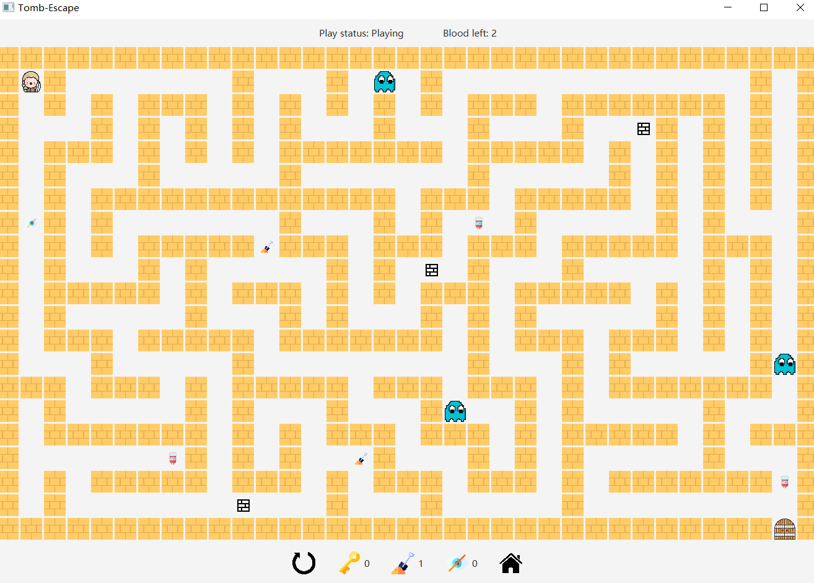

# Tomb Escape
<!-- <p align="center"></p> -->

---
Tomb Escape is a maze game written in JavaFX. The maze is generated randomly by Depth-First-Search algorithm. Player should get a key from a ghost with blood > 0 to escape from the tomb.  

## Run Configurations  
```
--add-modules javafx.controls,javafx.fxml,javafx.media
```

## How to Play  
<!-- <p align="center"></p>   -->

* Move around by press `A/W/S/D`.  
* Break the block by dragging the “spade” to the cell and get it cleared.  
* Click the item “Invisible cloak” to become invisible to the ghosts to avoid triggering the ghost game when meet the ghost, and the duration is 5s.  
* In trap game, hover the mouse to change the direction of the shield to protect yourself from bullets.  
* In ghost game, click the ghost as many times as possible.